

  

<h1 align="center">N2O Paper</h1>

  <strong>A light theme for Obsidian that reads like paper on a desk.</strong> 
  Warm cream sheets, bookcloth sidebars, tape and pencil marks, and seven colour palettes taken from the traditional colours of Japan.

  
  
  
  

  <a href="https://n2osync.com">Website</a> /
  <a href="https://github.com/n2osync/n2o-paper-settings">Settings plugin</a> /
  <a href="https://github.com/n2osync/n2o-paper/issues/new">Report a bug</a> /
  <a href="https://github.com/n2osync/n2o-paper/issues/new">Request a feature</a>

  

---

> **Not an Obsidian product.** N2O Paper is an independent theme. It is not made
> by, endorsed by, or affiliated with Obsidian.

## A page, not a screen

The window is a desk. The note is a sheet of cream stock resting on it, with a
grain you can see at full zoom and never at reading distance, and a light that
falls from the top left and softens at the foot of the page.

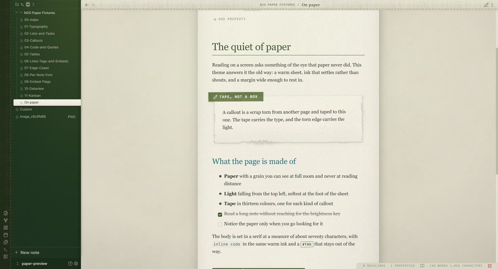

## The details we sweated

**A callout is a scrap of paper taped to the sheet.** The tape carries the type,
in one of thirteen colours. The torn edge is a real tear, drawn as a nine slice
mask so it never repeats the same way twice, and the shadow follows the tear
rather than a rectangle.

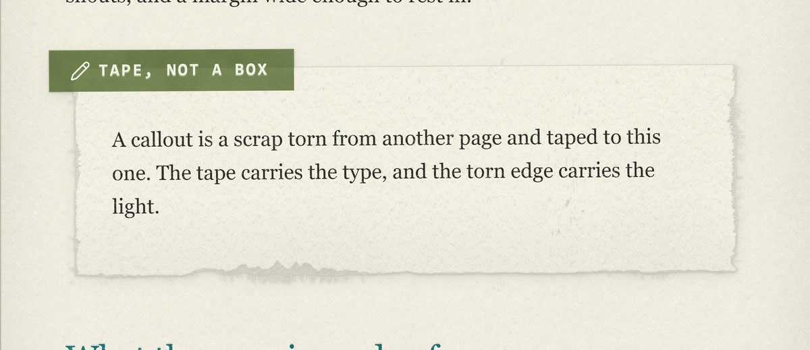

**Tasks are pencil marks.** A checked box is drawn in pencil, and the line
through the text is struck in the same hand. A nested list under a done task
keeps its own ink.

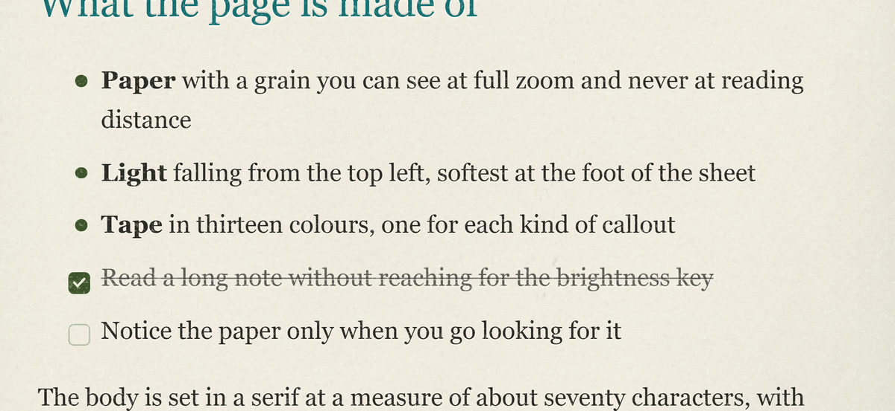

**Code sits on its own slip**, syntax coloured, with no paper texture over it,
because ink on a printed slab does not break the way ink on paper does.

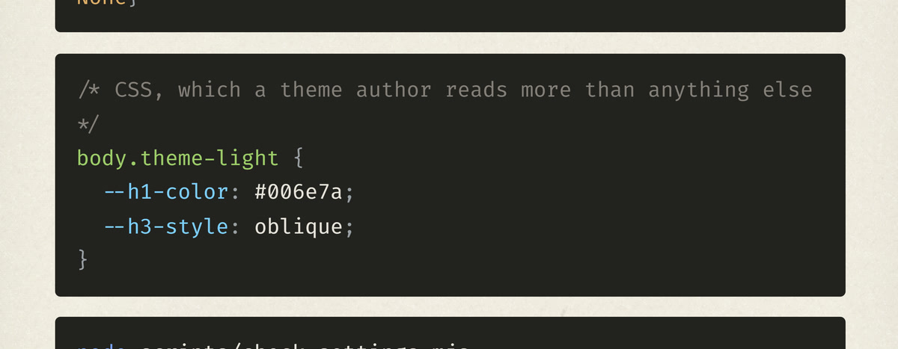

**A quote is a sheet with a coil binding** down its left edge, punched holes and
all. Turn it off if you would rather have a plain rule.

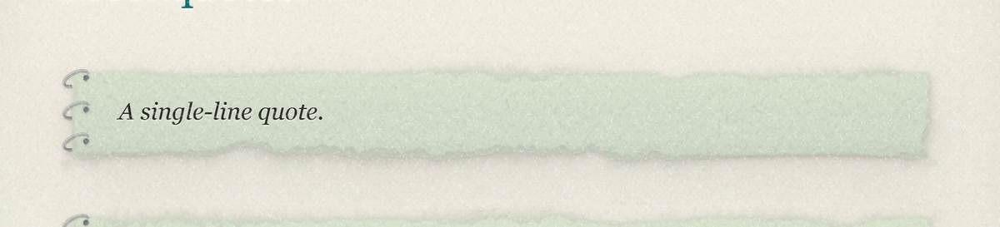

**Tables are cards**, with a coloured header band, hairline rules and a quiet
alternating tint. Dataview and Kanban get the same treatment: a board is a desk,
each lane a sheet, each card a slip of paper.

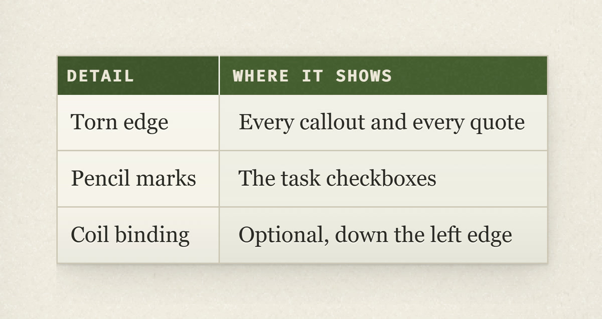

## Seven palettes

One hue runs through the whole app: the title, the links, the table header, the
sidebar and the light that falls across it. Five of the seven take exact colours
from the traditional colours of Japan.

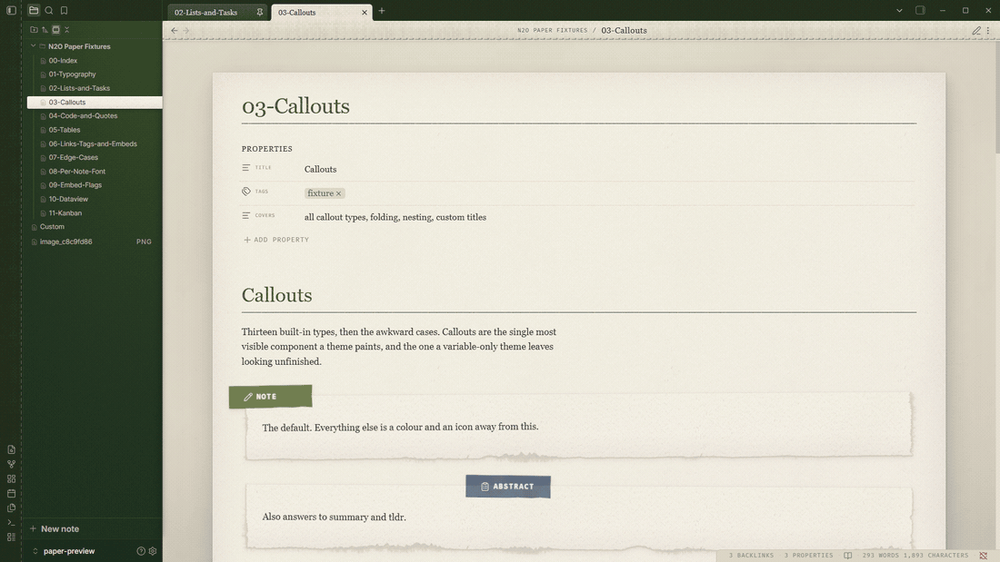

**Forest**, the theme's own, measured from two meadow photographs.

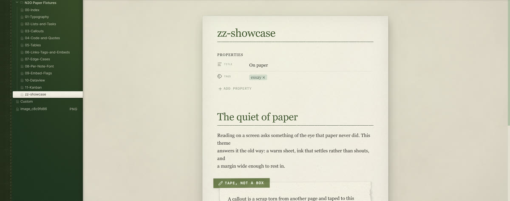

**Ink**, indigo dyeing: navy cloth, deep blue, a forget-me-not light.

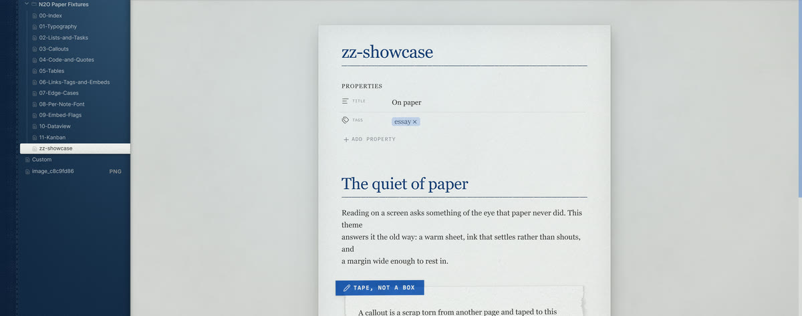

**Oxblood**, a dark blood red with an ENJI glow on the sidebars.

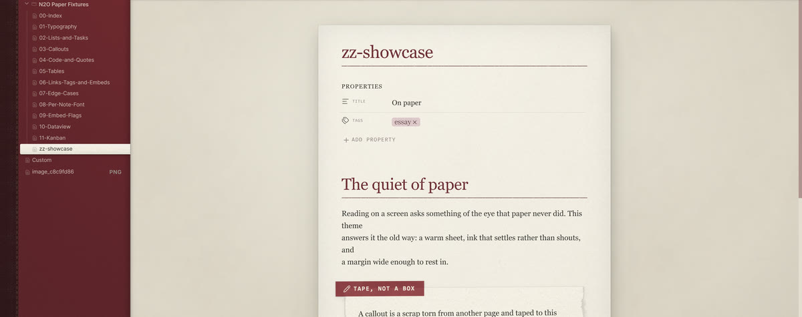

**Rose**, rose in bloom, NAKABENI light on cream paper.

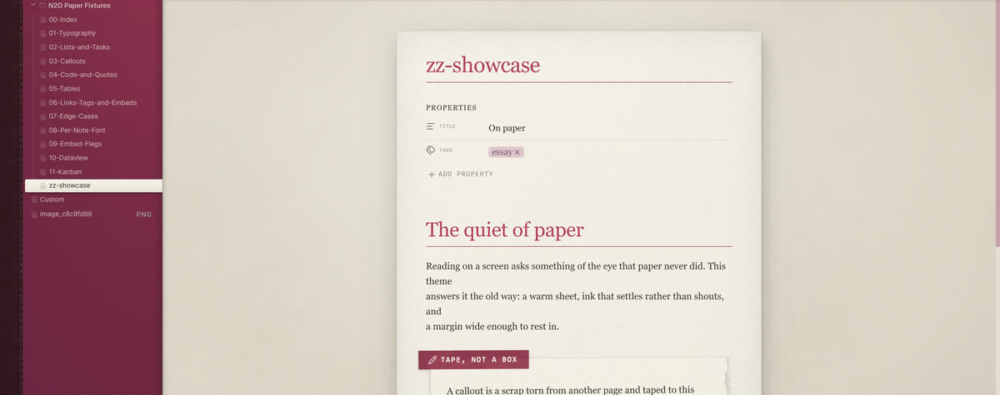

**Sepia**, a tea house: scorched tea, chestnut, amber, a celadon cup.

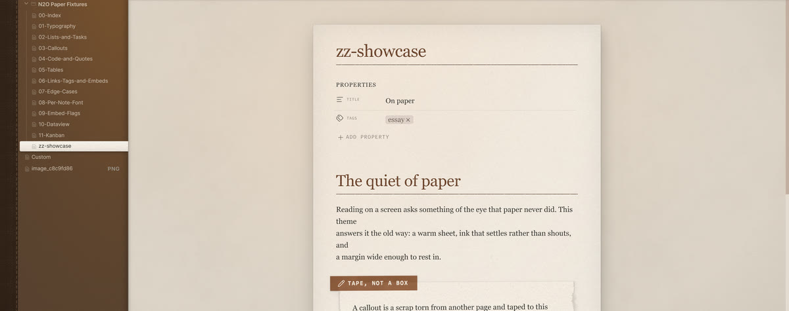

**Graphite** is pencil lead and **Coal** is sumi ink, both monochrome, with
nothing coloured but the two fixed heading levels.

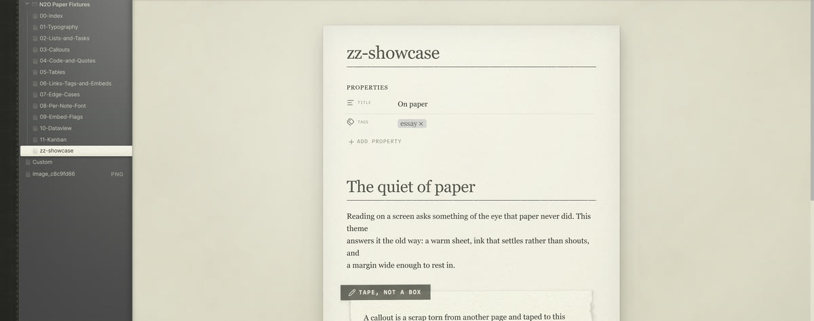

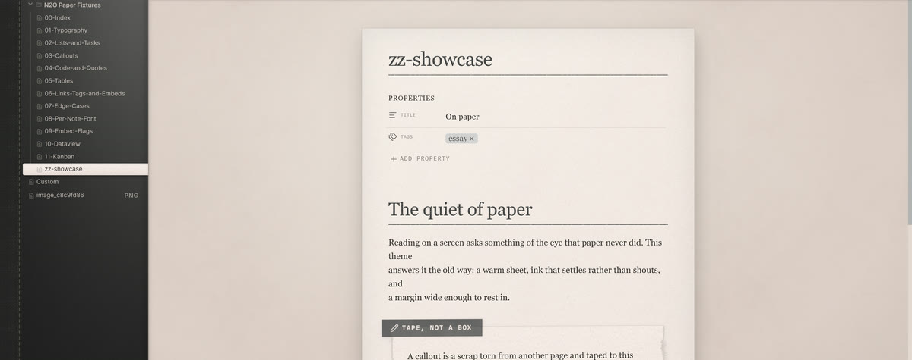

## Made to be read

Long reading was the whole point, so the type is set for it: a serif body at a
measure of about seventy characters, headings that step down in colour rather
than shout in size, and a page that holds its measure when you split the window
or open it on a phone.

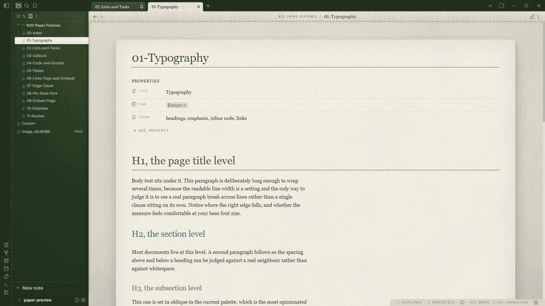

The palette is deliberately soft. Ink that settles rather than shouts, pale
teals and warm greys, so an hour in a note is an hour your eyes can take.

## Make it yours

The theme carries 110 controls: the palette, fonts and sizes, paper texture and
light, headings, callouts, code, tables and the interface itself. A theme is CSS
and cannot draw a settings tab, so they are rendered by
[N2O Paper Settings](https://github.com/n2osync/n2o-paper-settings), free and in
the community plugin list. Install that and everything above is a dropdown, a
slider or a colour swatch.

Install the plugin and it brings this theme with it. The controls also work with
the [Style Settings](https://github.com/mgmeyers/obsidian-style-settings) plugin
if that is the one you already have. With neither installed the theme still
looks the way it is meant to: every default is the theme's own.

Nine sections, 110 controls: **Looks** (palette, sidebars, heading size, font
set), **Colours** (every ink on the page, with live swatches), **Typography**,
**Layout**, **Paper** (grain, light, drift, softbox), **Components** (callouts,
tables, tasks, tags, embeds), **Code** (syntax colour by colour), **Interface**,
and **Advanced**, the fine numbers behind the presets. Export writes what you
changed to the clipboard, and Import puts it back.

## Install

Settings > Appearance > Themes > Manage, then search for N2O Paper.

To install it by hand, download `theme.css` and `manifest.json` from the latest
release into `<vault>/.obsidian/themes/N2O Paper/`, then pick the theme in
Appearance.

## Light only

N2O Paper is a light theme. In dark mode it applies nothing and Obsidian's own
dark look shows, so there is no half painted page.

## Licence

MIT. See LICENSE.md.
