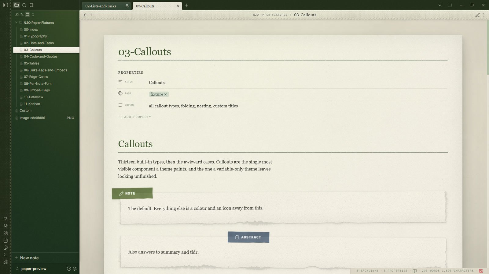
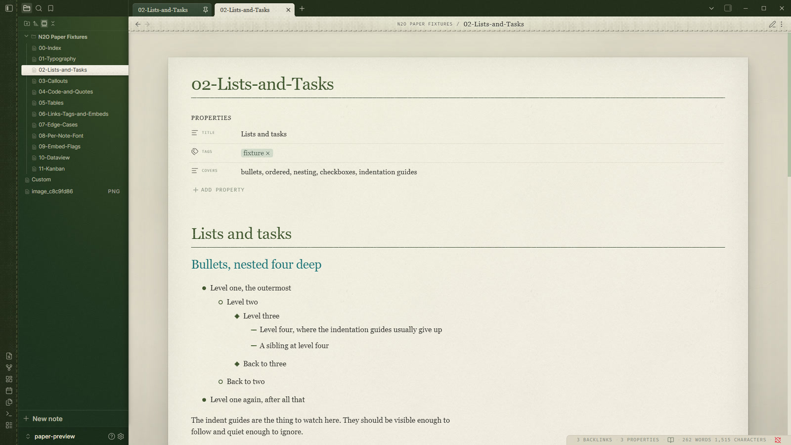
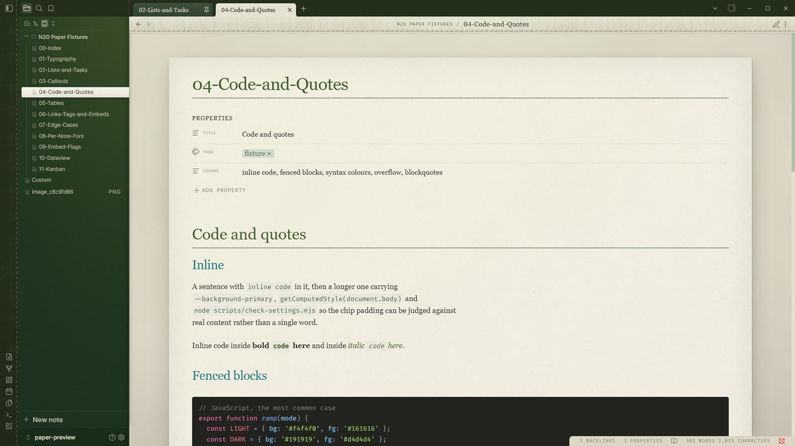
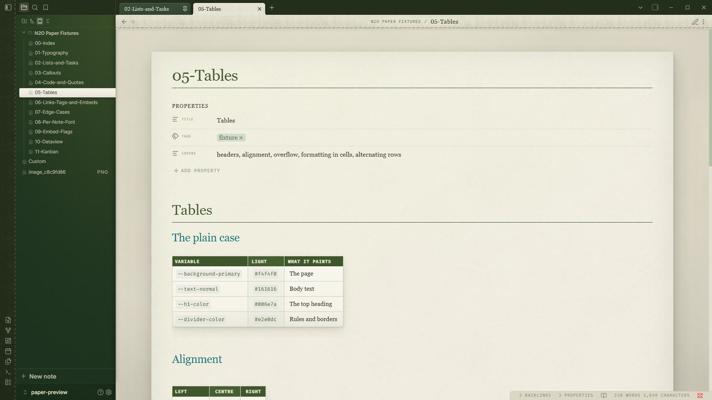
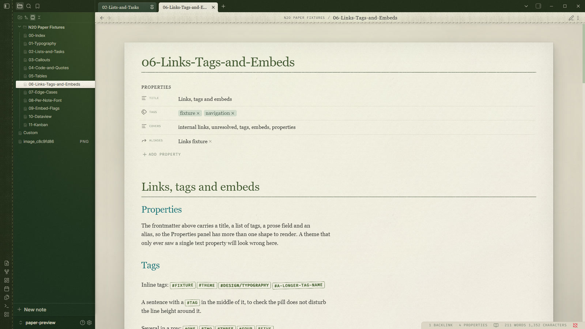
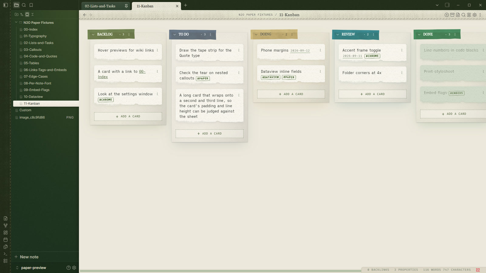
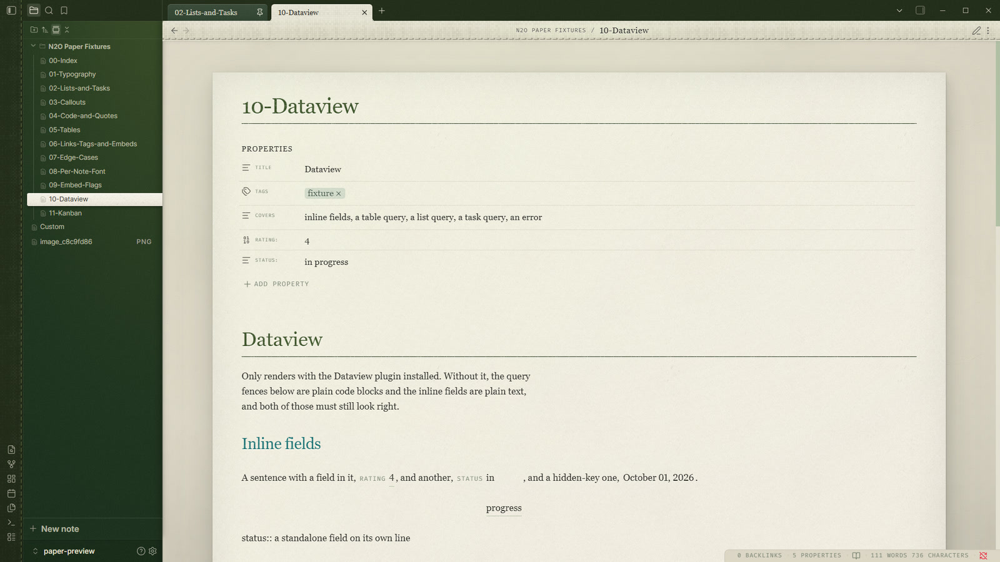

# N2O Paper

A light theme for Obsidian that reads like paper on a desk. Warm cream sheets,
bookcloth sidebars, tape and pencil marks, and seven colour palettes taken from
the traditional colours of Japan.

## Make it yours: N2O Paper Settings

The theme carries 110 controls: the palette, the fonts and sizes, the paper
texture and light, headings, callouts, code, tables and the interface itself.
A theme is CSS and cannot draw a settings tab, so the controls are rendered by
a companion plugin, [N2O Paper Settings](https://github.com/n2osync/n2o-paper-settings),
free and in the community plugin list. Install that and everything below is a
dropdown, a slider or a colour swatch.

Install the plugin and it brings this theme with it. The controls also work with
the [Style Settings](https://github.com/mgmeyers/obsidian-style-settings) plugin,
if that is the one you already have. With neither installed the theme still
looks the way it is meant to: every default is the theme's own.

## Seven palettes

One hue runs through the whole app: the title, the links, the table header, the
sidebar and the light that falls across it.

| | |
|---|---|
| **Forest**, the theme's own, measured from two meadow photographs |  |
| **Ink**, indigo dyeing: navy cloth and a forget-me-not light |  |
| **Oxblood**, a dark blood red with an ENJI glow |  |
| **Rose**, rose in bloom, NAKABENI light on cream paper |  |
| **Sepia**, a tea house: scorched tea, chestnut, amber |  |
| **Graphite**, pencil lead, monochrome |  |
| **Coal**, sumi ink, near black |  |

## The page

Every note is a sheet: aged paper grain, a soft light over the desk, and wide
shadows that lift each piece off the page.

**Callouts are scraps of paper taped to the sheet**, one colour of tape per
type, with torn edges.

**Tasks are pencil marks.** A done task is struck through in the same hand.

**Code sits on its own slip**, syntax coloured to match the palette, in both
Reading view and Live Preview.

**Tables are cards** with a coloured header band.

**Links, tags and embeds** carry the palette, and an embed can be framed, torn,
floated left or right, or left with no frame at all.

**Dataview and Kanban get the same treatment.** A board is a desk, each lane a
sheet, each card a slip of paper.

## Install

Settings > Appearance > Themes > Manage, then search for N2O Paper.

To install it by hand, download `theme.css` and `manifest.json` from the latest
release into `<vault>/.obsidian/themes/N2O Paper/`, then pick the theme in
Appearance.

## Light only

N2O Paper is a light theme. In dark mode it applies nothing and Obsidian's own
dark look shows, so there is no half painted page.

## What the settings cover

Nine sections, 110 controls, through
[N2O Paper Settings](https://github.com/n2osync/n2o-paper-settings) or Style
Settings: **Looks** (palette, sidebars, heading size, font set), **Colours**
(every ink on the page, with live swatches), **Typography**, **Layout**,
**Paper** (grain, light, drift, softbox), **Components** (callouts, tables,
tasks, tags, embeds), **Code** (syntax colour by colour), **Interface**, and
**Advanced**, which holds the fine numbers behind the presets. Export writes
what you changed to the clipboard, and Import puts it back.

## Licence

MIT. See LICENSE.md.
